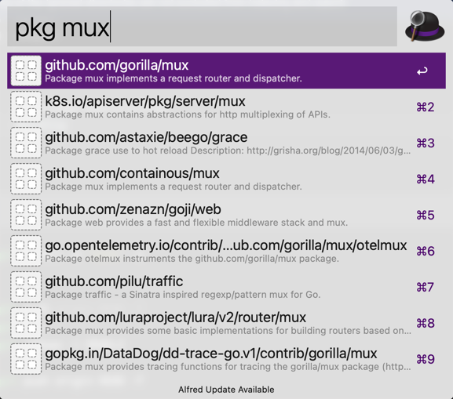

# go-package-search-alfred

Usage:
1. Download and install workflow from release page
2. Use keyword **pkg**

---
Inspired by & Refer From [GoSearch](https://github.com/mingrammer/gosearch) @mingrammer